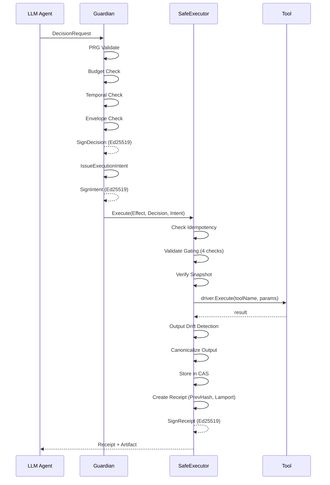

# 04 — Execution Kernel & Replay

**Score: 4/5** · Gate ≥3 · **✅ PASS**

---

## Architecture (Verified from Source Code)

### Guardian → Executor Pipeline



### Guardian (`guardian.go`, 347 LOC)

| Function | LOC | Purpose |
|----------|-----|---------|
| `SignDecision` | L82-183 | PRG → Budget → Temporal → Envelope → Sign |
| `IssueExecutionIntent` | L185-227 | JCS effect digest, 5min expiry, tool constraint |
| `EvaluateDecision` | L261-332 | High-level API combining both |
| `checkEnvelope` | L229-242 | Structural validation |

### SafeExecutor (`executor.go`, 341 LOC)

| Function | LOC | Purpose |
|----------|-----|---------|
| `Execute` | L62-204 | Main pipeline: 8 stages |
| `checkIdempotency` | L206-213 | Dedup via receiptStore |
| `validateGating` | L215-247 | 4-step cryptographic verification |
| `verifySnapshot` | L249-268 | Phenotype hash matching |
| `createReceipt` | L270-314 | ProofGraph DAG receipt with PrevHash |
| `ApplyCompilerPolicy` | L334-340 | Dynamic tool prohibition |

### 7-Stage Execution Pipeline (executor.go)

| # | Stage | Code | Fail Mode |
|---|-------|------|-----------|
| 0 | Pre-flight | L64-67 | Error: "missing decision" |
| 1a | Idempotency | L69-80 | Return existing receipt |
| 1b | Gating | L82-85 | Error: sig/verdict/expiry |
| 2 | Snapshot | L87-91 | Error: phenotype mismatch |
| 3 | Tool Prep | L93-111 | Error: missing tool, policy violation |
| 4 | Dispatch | L120-125 | Error: tool failure |
| 5 | Drift Check | L127-136 | Error: `ERR_CONNECTOR_CONTRACT_DRIFT` |
| 6 | Canonicalize | L138-150 | Error: canonicalization failed |
| 7 | CAS Store | L152-164 | Error: integrity violation |
| 8 | Receipt Sign | L167-172 | Error: "fail-closed" |

**Every stage fails closed — no silent pass-through.**

---

## JCS Canonicalization (Verified: `canonicalize/jcs.go`, 139 LOC)

### Implementation Details

```go
func JCS(v interface{}) ([]byte, error) {
    // 1. Standard json.Marshal (handles struct tags)
    intermediate, _ := json.Marshal(v)

    // 2. Decode to generic interface{} with UseNumber()
    decoder := json.NewDecoder(bytes.NewReader(intermediate))
    decoder.UseNumber()  // Preserve numeric precision

    // 3. marshalRecursive with RFC 8785 compliance
    return marshalRecursive(generic)
}
```

### RFC 8785 Compliance Checklist
| Requirement | Status | Evidence |
|-------------|--------|----------|
| Sorted map keys | ✅ | `sort.Strings(keys)` in marshalRecursive L110 |
| No HTML escaping | ✅ | `enc.SetEscapeHTML(false)` L67 |
| Number precision | ✅ | `decoder.UseNumber()` L29, `json.Number.String()` L79 |
| Compact format | ✅ | No indent, no whitespace |
| Trailing newline | ✅ | `bytes.TrimSuffix(buf.Bytes(), []byte{'\n'})` |

### JCS Coverage: 65.9%

---

## Replay Engine (Verified: `replay/engine.go`, 256 LOC)

### Capabilities
| Feature | Status | Evidence |
|---------|--------|----------|
| Event-sourced replay | ✅ | `StartReplay()` L107-187 |
| Divergence detection | ✅ | Hash comparison at each step (L163) |
| PRNG seed per event | ✅ | `RunEvent.PRNGSeed` field (L72) |
| Run hash vs replay hash | ✅ | `computeRunHash()` L200-212, `computeReplayHash()` L215-226 |
| Session lifecycle | ✅ | RUNNING → COMPLETE/DIVERGED/FAILED |
| Integrity verification | ✅ | `VerifyReplayIntegrity()` L229-255 |
| Injectable clock | ✅ | `WithClock()` L101-104 |

### Replay Coverage: 59.1% — should be higher for an audit-critical component.

---

## Determinism Analysis

### What IS Deterministic
1. **JCS serialization**: Same input → same canonical bytes (RFC 8785)
2. **SHA-256 hashing**: Deterministic by definition
3. **Lamport clock**: Monotonic increment, no time dependency
4. **PrevHash chain**: Signature of previous receipt → deterministic link
5. **Receipt structure**: All fields are explicit, no ambient state

### What is NOT Deterministic
1. **`time.Now()` in Executor** (SEC-003): Receipt timestamps, intent expiry
2. **`uuid.New()` in Evidence Exporter**: Bundle IDs are random
3. **ProofGraph node hashing** (SEC-001): Uses json.Encoder not JCS — hash may vary
4. **PRNG seed**: Present in RunEvent but no evidence of seed injection at execution time

### CI Determinism Test Status
- No dedicated CI step that runs the replay engine against golden vectors
- `conform/adversarial/` has 0% coverage — adversarial replay not tested
- Conformance test infrastructure exists (`conform/engine.go`, `conform/evidencepack_test.go`) but integration unclear

---

## Score Justification: 4/5

| Factor | Assessment |
|--------|-----------|
| Pipeline integrity | ✅ 7-stage fail-closed execution |
| JCS compliance | ✅ RFC 8785 correct implementation |
| Replay engine | ✅ Implemented with divergence detection |
| Causal ordering | ✅ PrevHash + LamportClock + ArgsHash |
| CI determinism proof | ⚠️ No golden vector tests in CI |
| PRNG seed injection | ⚠️ Field exists but runtime injection unclear |

**Why 4 not 5**: No CI-verified determinism test with golden vectors. ProofGraph node hashing inconsistency with JCS. time.Now() violations in Executor.
